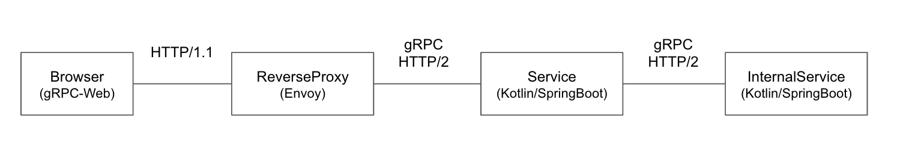
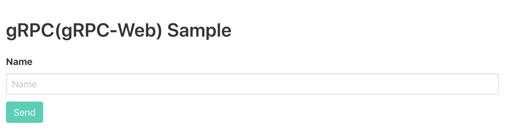
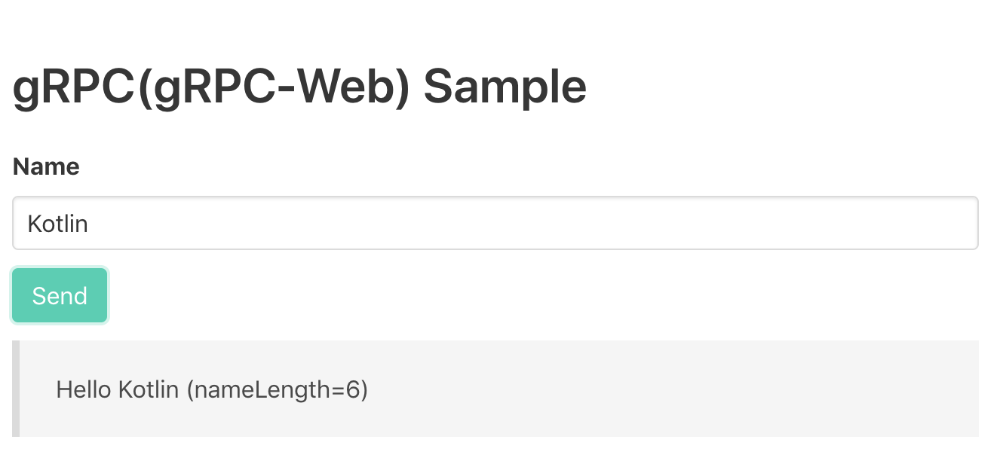
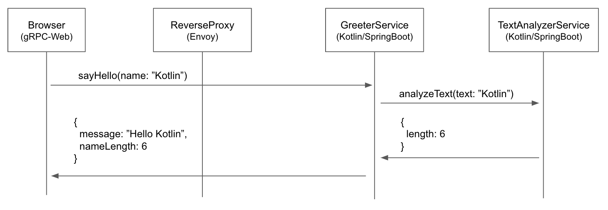

# grpc-web-kotlin-sample

This is a sample project aims to try [gRPC-Web](https://github.com/grpc/grpc-web).

Backend service is built with Kotlin + Spring Boot with [grpc-spring-boot-starter](https://github.com/LogNet/grpc-spring-boot-starter).



## How to run

```sh
$ git clone git@github.com:hosopy/grpc-web-kotlin-sample.git
$ cd grpc-web-kotlin-sample
$ docker-compose up
```

After initialization process, you can access `http://localhost:3000`.



Input name and press send, and you can see a result received from gRPC service.



## Message sequence

Below is a message sequence.


